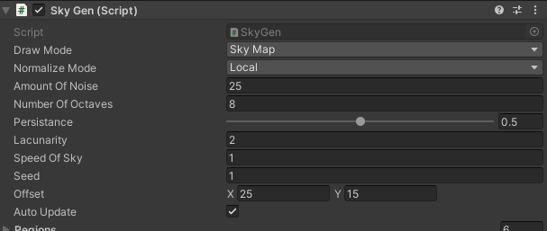
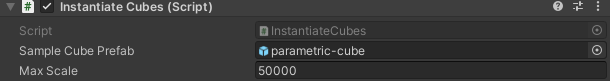
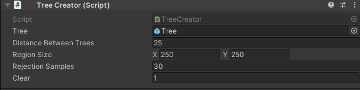

# Project Title

Name: Adam Nolan	

Student Number: C18363931	

Class Group: TU856-4

# Description of the project
The initial goal for my project was to procedurally generated Landmass/Island apropriately coloured with mountians and tree's with stuff in the sky and some audio. maybe some visuals in the distance, like a sound bar that moves to the music(stretch goal) that the player could walk around in. 

goals:
implementing perlin noise to procedurally generate the island terrain
allow a person to use Unity Editor to generate new and unique islands
feature personally created audio
implementing procedural tree creation

# Instructions for use
to use you just have to click play. once you do it will run with the currently configured settings and just work as is.
if you wish to moddify the way in which everything is created and run you can use the different options to change them.





# How it works

# List of classes/assets in the project and whether made yourself or modified or if its from a source, please give the reference

| Class/asset | Source |
|-----------|-----------|
| MyClass.cs | Self written |
| MyClass1.cs | Modified from [reference]() |
| MyClass2.cs | From [reference]() |

# References

# What I am most proud of in the assignment

# Proposal submitted earlier can go here:

## This is how to markdown text:

This is *emphasis*

This is a bulleted list

- Item
- Item

This is a numbered list

1. Item
1. Item

This is a [hyperlink](http://bryanduggan.org)

# Headings
## Headings
#### Headings
##### Headings

This is code:

```Java
public void render()
{
	ui.noFill();
	ui.stroke(255);
	ui.rect(x, y, width, height);
	ui.textAlign(PApplet.CENTER, PApplet.CENTER);
	ui.text(text, x + width * 0.5f, y + height * 0.5f);
}
```

So is this without specifying the language:

```
public void render()
{
	ui.noFill();
	ui.stroke(255);
	ui.rect(x, y, width, height);
	ui.textAlign(PApplet.CENTER, PApplet.CENTER);
	ui.text(text, x + width * 0.5f, y + height * 0.5f);
}
```

This is an image using a relative URL:


This is an image using an absolute URL:


This is a youtube video:

[](https://www.youtube.com/watch?v=J2kHSSFA4NU)

This is a table:

| Heading 1 | Heading 2 |
|-----------|-----------|
|Some stuff | Some more stuff in this column |
|Some stuff | Some more stuff in this column |
|Some stuff | Some more stuff in this column |
|Some stuff | Some more stuff in this column |

