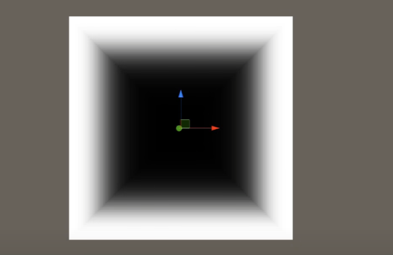
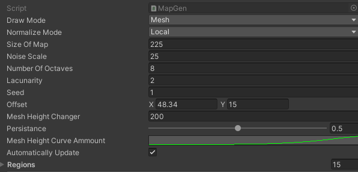

# Project Title

Name: Adam Nolan	

Student Number: C18363931	

Class Group: TU856-4

# Description of the project
The initial goal for my project was to procedurally generated Landmass/Island apropriately coloured with mountians and tree's with stuff in the sky and some audio. maybe some visuals in the distance, like a sound bar that moves to the music(stretch goal) that the player could walk around in. 

goals:
implementing perlin noise to procedurally generate the island terrain
allow a person to use Unity Editor to generate new and unique islands
feature personally created audio
implementing procedural tree creation

# Instructions for use
to use you just have to click play. once you do it will run with the currently configured settings and just work as is.
if you wish to moddify the way in which everything is created and run you can use the different options to change them.

# How it works
This project uses perlin noise maps to create height maps which is used for Terrain Chunk generation that creates a mesh that the player can walk on. you enter the colours of each of the different regions and then by setting the amount of noise, number of octaves, persistance, lacunarity, speed, height and height curve you can modify the map to your liking and make a ton of different terrain.
I use a falloffmap as shown below to make the perimeter of the map water so that the landmass is now waterlocked.

Land Chunk Data Generator
The above image is used to configure the land generation characteristics. We have the following parametres:

Noise Scale : Used to control the initial division of offset coordinates into a Perlin noisemap, this provides zoom.
Number of Octaves: number of layers of perlin noise.
Persistance: What fraction of amplitude persists in each Octave. (0-1)
Lacunarity: this gives the perlin noise map a focus on overall terrain heights with each passing octave growing larger and larger focusing on finer details, improving your ability to emulate terrain
Seed: A seed is used to give pseudo random generation to the perlin noisemap
Offset: An offset can be applied to pick an initial coordinate the generation begins from on the noisemap.

# List of classes/assets in the project and whether made yourself or modified or if its from a source, please give the reference

| Class/asset | Source |
|-----------|-----------|
| Tree.prefab | Self Created |
| AllDisplays.cs | Modified from [reference] Modified from [Sebastian Lague's Terrain Generation Tutorial Series EP 1-11 (https://www.youtube.com/watch?v=wbpMiKiSKm8&list=PLFt_AvWsXl0eBW2EiBtl_sxmDtSgZBxB3) |
| FallOffMap.cs | From [Sebastian Lague's Terrain Generation Tutorial Series EP 1-11 (https://www.youtube.com/watch?v=wbpMiKiSKm8&list=PLFt_AvWsXl0eBW2EiBtl_sxmDtSgZBxB3) |
| MapGen.cs | Modified from [Sebastian Lague's Terrain Generation Tutorial Series EP 1-11 (https://www.youtube.com/watch?v=wbpMiKiSKm8&list=PLFt_AvWsXl0eBW2EiBtl_sxmDtSgZBxB3) |
| FallOffMap.cs | Modified from [Sebastian Lague's Terrain Generation Tutorial Series EP 1-11 (https://www.youtube.com/watch?v=wbpMiKiSKm8&list=PLFt_AvWsXl0eBW2EiBtl_sxmDtSgZBxB3) |
| MeshGen.cs | Modified from [Sebastian Lague's Terrain Generation Tutorial Series EP 1-11 (https://www.youtube.com/watch?v=wbpMiKiSKm8&list=PLFt_AvWsXl0eBW2EiBtl_sxmDtSgZBxB3) |
| Noise.cs | Modified from [Sebastian Lague's Terrain Generation Tutorial Series EP 1-11 (https://www.youtube.com/watch?v=wbpMiKiSKm8&list=PLFt_AvWsXl0eBW2EiBtl_sxmDtSgZBxB3) |
| SkyGen.cs | Modified from [Sebastian Lague's Terrain Generation Tutorial Series EP 1-11 (https://www.youtube.com/watch?v=wbpMiKiSKm8&list=PLFt_AvWsXl0eBW2EiBtl_sxmDtSgZBxB3) |
| TextureGen.cs | Modified from [Sebastian Lague's Terrain Generation Tutorial Series EP 1-11 (https://www.youtube.com/watch?v=wbpMiKiSKm8&list=PLFt_AvWsXl0eBW2EiBtl_sxmDtSgZBxB3) |
| AudioPeer.cs | Modified From [Peer Play- Audio Visualization playlist](https://www.youtube.com/watch?v=5pmoP1ZOoNs&list=PL3POsQzaCw53p2tA6AWf7_AWgplskR0Vo&ab_channel=PeerPlay)|
| InstantiateCubes.cs | Modified From [Peer Play- Audio Visualization playlist](https://www.youtube.com/watch?v=5pmoP1ZOoNs&list=PL3POsQzaCw53p2tA6AWf7_AWgplskR0Vo&ab_channel=PeerPlay) |
| PoissonDiscSampling.cs | From [reference](https://www.youtube.com/watch?v=7WcmyxyFO7o&ab_channel=SebastianLague) |
| TreeCreator.cs | Modified from [reference](https://www.youtube.com/watch?v=7WcmyxyFO7o&ab_channel=SebastianLague) |
| RigidbodyFirstPersonController.cs | From [reference](https://assetstore.unity.com/packages/essentials/asset-packs/standard-assets-for-unity-2018-4-32351) |
| MouseLook.cs | From [reference](https://assetstore.unity.com/packages/essentials/asset-packs/standard-assets-for-unity-2018-4-32351) |
| handcreatedleaf.png | Self Created |
| Mix No1.wav | Self Created |

# References
 [Sebastian Lague's Terrain Generation Tutorial Series EP 1-11](https://www.youtube.com/watch?v=wbpMiKiSKm8&list=PLFt_AvWsXl0eBW2EiBtl_sxmDtSgZBxB3)
[Sebastian Lague's poisson disc sampling] https://www.youtube.com/watch?v=7WcmyxyFO7o&ab_channel=SebastianLague
[Peer Play's Audio Visualisation] https://www.youtube.com/playlist?list=PL3POsQzaCw53p2tA6AWf7_AWgplskR0Vo
[unities legacy character movement scripts] https://assetstore.unity.com/packages/essentials/asset-packs/standard-assets-for-unity-2018-4-32351
# What I am most proud of in the assignment
That I finsished it.
# Proposal submitted earlier can go here:
Procedurally generated Landmass/Island apropriately coloured with mountians and tree's with stuff in the sky and some audio ill get mixed. maybe some visuals in the distance, like a sound bar that moves to the music(stretch goal)

